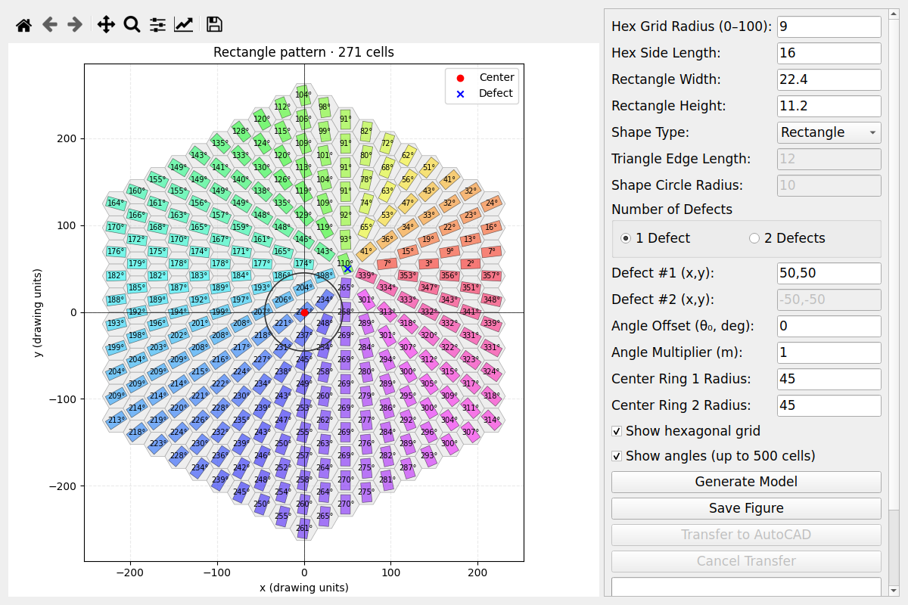

# AutoCAD MicroPattern

A desktop tool for drawing hexagonal arrays of rectangles, triangles, or circles.
Set the shape dimensions and defect positions, preview the pattern, then save a
figure or send the geometry to AutoCAD.

The GUI runs on Windows, Linux, and macOS. AutoCAD transfer works on Windows and
from WSL through a Windows Python helper.



## Setup

Use Python 3.10 or newer. WSL needs WSLg or another display server to show the GUI.
AutoCAD transfer requires AutoCAD for Windows with COM automation support.

```bash
git clone https://github.com/aliaslandemir/autocadmicropattern.git
cd autocadmicropattern
```

### Windows

In PowerShell:

```powershell
py -3 -m venv .venv
.venv\Scripts\Activate.ps1
python -m pip install -r requirements.txt
python GUI.py
```

The Windows requirements include `pyautocad` and `pywin32` for AutoCAD transfer.

### Linux, WSL, or macOS

```bash
python3 -m venv .venv
source .venv/bin/activate
python -m pip install -r requirements.txt
python GUI.py
```

On Ubuntu, install `python3-venv` if creating the environment fails because
`ensurepip` is missing. If Qt reports a missing `xcb` library, install the library
named in the error.

### Sending patterns from WSL to Windows AutoCAD

Install Python on Windows as well as in WSL. The Windows environment only needs
`pyautocad` and `pywin32`.

For a Windows Miniforge installation, run these commands in WSL. Replace
`YOUR_USERNAME` and the installation path with your own:

```bash
/mnt/c/Users/YOUR_USERNAME/miniforge3/python.exe -m pip install pyautocad pywin32
export AUTOCAD_WINDOWS_PYTHON="/mnt/c/Users/YOUR_USERNAME/miniforge3/python.exe"
source .venv/bin/activate
python GUI.py
```

Add the `export` line to your shell profile to reuse it in later sessions. Paths
with spaces are supported when quoted. A Windows path such as
`C:\Users\YOUR_USERNAME\miniforge3\python.exe` also works.

If `AUTOCAD_WINDOWS_PYTHON` is unset, the app looks for `py.exe -3`, common Conda
installations under `/mnt/c/Users`, then `python.exe` on PATH. Set it explicitly
if you have several Python installations or `python.exe` opens the Microsoft Store.

The GUI sends geometry to the Windows helper over a pipe. You can keep the
project and its Linux environment in WSL; there is no need to copy them to Windows.
If the helper cannot launch, try running its `python.exe --version` from WSL and
check that [WSL interoperability](https://learn.microsoft.com/en-us/windows/dev-environment/wsl-interop)
is enabled.

For a checkout shared between Windows and WSL, use separate environments, such as
`.venv` and `.venv-win`. A Linux environment cannot run under Windows Python.

## Using the app

A default pattern appears when the app opens. Change the inputs and click
**Generate Model** to update it. Dimensions use AutoCAD drawing units; the angle
offset is in degrees.

- **Hex Grid Radius** sets the number of rings, from 0 to 100. There are
  `1 + 3r(r + 1)` cells; radius 0 gives one cell.
- **Hex Side Length** controls the spacing between cells.
- **Shape Type** selects rectangles, equilateral triangles, or circles.
- **Defects** take `x,y` coordinates and control the shape orientations. Choose
  one or two defects; the angle multiplier applies only to the one-defect mode.
- **Center Circles** adds rings around the origin. Set a radius to 0 to hide it.
  Equal radii produce one ring.
- **Save Figure** saves the current preview as PNG or PDF. Generate the preview
  again after changing inputs before saving.

Use the plot toolbar to zoom and pan. The grid and angle labels can be toggled;
angle labels are hidden for patterns with more than 500 cells.

### AutoCAD transfer

Open a drawing in AutoCAD, then click **Transfer to AutoCAD**. This updates the
preview and sends the current pattern to the drawing. Rectangles and triangles
are drawn as line segments, and circles as AutoCAD circle entities. The preview
grid, labels, and defect markers are left out.

Wait for the transfer to finish before editing the drawing. **Cancel Transfer**
stops after the current AutoCAD call completes. If a transfer fails or is
cancelled, some geometry may remain; use **Undo** in AutoCAD to remove the
transfer as one group.

### Orientation formulas

For one defect at `(x₁, y₁)`:

```text
θ = θ₀ + m atan2(y − y₁, x − x₁)
```

For two defects:

```text
θ = θ₀ + atan2(y − y₁, x − x₁) + atan2(y − y₂, x − x₂)
```

At a defect center, the preview uses `atan2(0, 0) = 0`. The physical director
field is singular at that point.

## Development

Run the tests in your Python environment:

```bash
python -m unittest discover -s tests -v
```

The suite checks geometry, input validation, GUI rendering, figure saving, and
AutoCAD transfer behavior using simulated COM objects and subprocesses. GUI tests
run offscreen. GitHub Actions runs the tests on Linux with Python 3.10 and 3.12.
Testing transfers into a real drawing requires Windows and AutoCAD.

The main files are `GUI.py` for the interface, `geometry.py` for pattern geometry,
`autocad_export.py` for transfer routing, and `autocad_bridge.py` for the Windows
helper.

## License

[MIT](License.md). By [Ali Aslan Demir](https://github.com/aliaslandemir).
